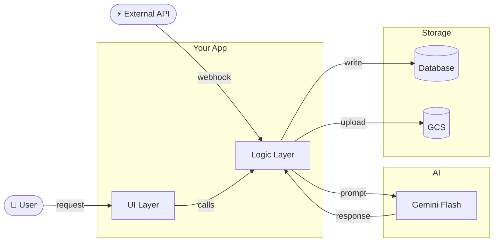
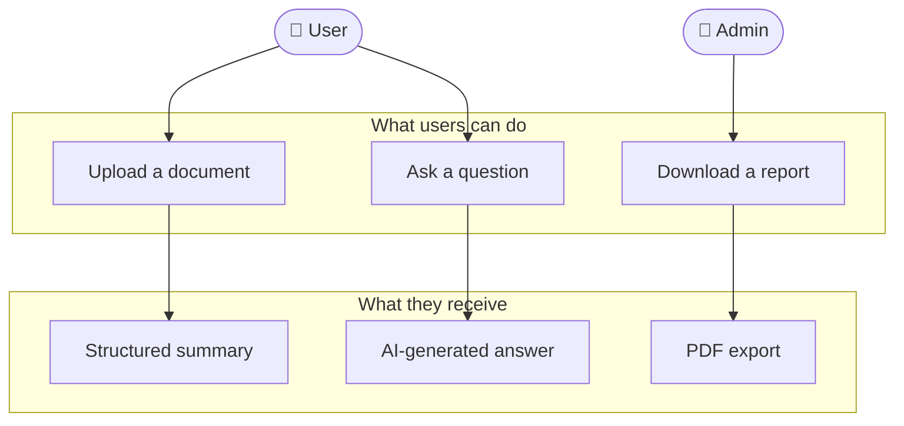
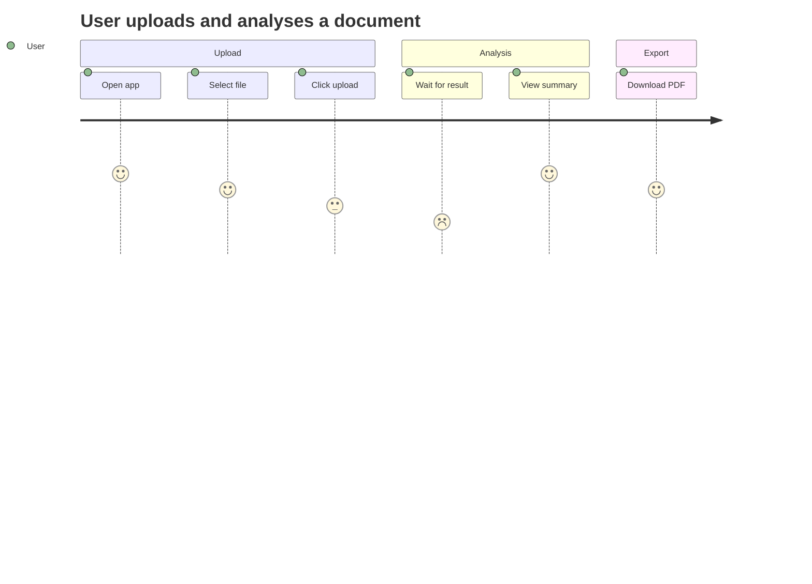
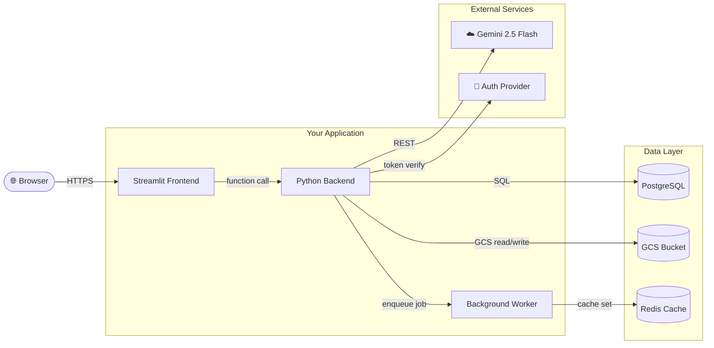
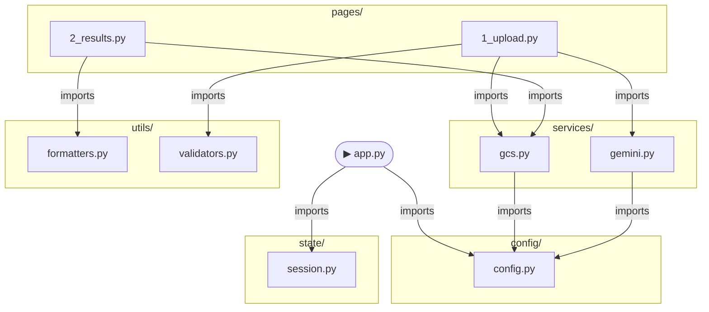

## Purpose

Read a repository and produce a `docs/arch.md` file containing **three levels of
architecture diagrams**, each rendered in Mermaid. The user can request one level,
two, or all three. Output is always a standalone Markdown file that renders in
GitHub, Notion, or any Mermaid-compatible viewer.

The four levels:

| Level | Name | Answers | Fits a slide? |
|-------|------|---------|--------------|
| **L0** | Slide View | What is this system, in one glance? | ✅ Designed for it |
| **L1** | User Level | What can a person *do* with this system? | ⚠️ Keep it small |
| **L2** | System Level | What services/components exist and how do they talk? | ❌ Too wide |
| **L3** | Codebase Level | Which files/modules import or call which? | ❌ Too dense |

---

## Golden Rules

1. **Read the whole repo before drawing anything.** A diagram built on guesses is worse than no diagram.
2. **Never invent components.** Only diagram what you can verify exists in the code or config.
3. **If `docs/arch.md` already exists, read it first** — preserve any hand-written notes, only update the Mermaid blocks.
4. **Label edges with the actual mechanism** — HTTP, gRPC, import, GCS read, SQL query — not just arrows.
5. **Keep each diagram scannable at a glance.** If a level has >20 nodes, cluster into subgraphs.
6. **Mermaid only** — no external diagram tools, no image generation, no PlantUML.

---

## Phase 0 — Read the Repo

Run all of these before writing a single diagram node:

```bash
# Full file tree (exclude noise)
find . -type f | grep -v __pycache__ | grep -v .git | grep -v node_modules \
  | grep -v ".pyc" | grep -v dist | sort

# Entry points
find . -name "app.py" -o -name "main.py" -o -name "index.ts" \
  -o -name "index.js" -o -name "server.py" -o -name "manage.py" | sort

# Config files (reveal services)
find . -name "docker-compose*" -o -name "*.yaml" -o -name "*.yml" \
  -o -name "Dockerfile*" -o -name ".env.example" | sort

# Dependencies (reveal external services)
cat requirements.txt 2>/dev/null || cat package.json 2>/dev/null \
  || cat Pipfile 2>/dev/null || cat go.mod 2>/dev/null

# Read existing arch doc if present
cat docs/arch.md 2>/dev/null || echo "No existing arch.md found"

# For Python repos — find all imports across files
grep -rn "^import\|^from" . --include="*.py" | grep -v __pycache__ | sort

# For JS/TS repos — find all imports
grep -rn "^import\|require(" . --include="*.ts" --include="*.js" \
  | grep -v node_modules | sort

# Find all HTTP/API calls
grep -rn "requests\.\|fetch(\|axios\.\|httpx\.\|urllib" . \
  --include="*.py" --include="*.ts" --include="*.js" | grep -v node_modules

# Find all database/storage references
grep -rn "storage\.Client\|boto3\|psycopg\|pymongo\|redis\|firestore\|supabase\|prisma" \
  . --include="*.py" --include="*.ts" | grep -v node_modules
```

**Internally answer before drawing:**
1. What does this app do in one sentence?
2. Who are the actors? (end user, admin, external API, cron job?)
3. What external services are called? (GCS, S3, Stripe, OpenAI, a DB?)
4. What is the entry point? What happens first when the app runs?
5. Which files are the heaviest hitters (most imported by others)?
6. Are there multiple services / microservices, or a monolith?

**Tell the user your findings in plain English before generating diagrams.**

---

## Phase 0.5 — L0: Slide View Diagram

**Question this answers:** *What is this system, in one glance — for a slide deck?*

This is the only level **designed to fit inside a rectangular presentation slide**.
It is a single, horizontally-balanced `flowchart LR` with hard node and depth limits
so it never overflows the slide boundary.

### Slide fit constraints — never break these

| Constraint | Limit | Why |
|------------|-------|-----|
| Total nodes | **≤ 12** | More than 12 overflows a 16:9 slide |
| Subgraph depth | **1 level only** — no nested subgraphs | Nested boxes shrink text to unreadable |
| Edge labels | **≤ 4 words** | Longer labels wrap and break layout |
| Node label length | **≤ 20 characters** | Truncate or abbreviate if needed |
| Direction | **`flowchart LR`** | Left-to-right fits widescreen slides |
| Subgraphs | **2–4 max** | Columns on a slide — one per concern |

### What L0 shows

Three columns only — input, your system, output:

```
[Who/What sends data] → [Your System internals] → [Where it goes / what it produces]
```

Group the internals into **2–3 named subgraphs** max. Each subgraph is one "column"
on the slide. Edges only cross between columns — never within one.

### Template



### Slide-fit checklist — verify before writing L0

- [ ] Total nodes ≤ 12 (count every box and actor)
- [ ] No subgraph nested inside another subgraph
- [ ] Direction is `flowchart LR`
- [ ] Every edge label ≤ 4 words
- [ ] Every node label ≤ 20 characters (abbreviate if needed: "Background Worker" → "BG Worker")
- [ ] No more than 4 subgraphs
- [ ] Edges only flow left → right (no back-edges in L0 — save those for L2)

### When to generate L0

| User says | Action |
|-----------|--------|
| "slide" / "presentation" / "deck" / "one pager" | Generate L0 only |
| "fits on a slide" / "simple overview" | Generate L0 only |
| "all levels" / no qualifier | Generate L0 + L1 + L2 + L3 |
| "executive summary" | Generate L0 + L1 |

### L0 in the output file

Add L0 as the **first section** in `docs/arch.md`, before L1:

````markdown
## L0 — Slide View

One-glance overview. Designed to fit a 16:9 presentation slide.
Max 12 nodes · LR layout · 2–4 subgraphs · no nested boxes.

```mermaid
[L0 diagram here]
```
````

---

## Phase 1 — L1: User Level Diagram

**Question this answers:** *What can a person do with this system?*

Use a `flowchart TD` or `journey` diagram. Show:
- The **actors** (User, Admin, External System, Cron)
- The **actions** they can take (verbs, not code)
- The **outcomes** they receive
- **Nothing about code, files, or services** — this is the human-facing view

### Template



### Rules for L1
- **Max 15 nodes total** — merge minor actions into one node if needed
- Use **plain English labels** — no function names, no filenames
- Use **emoji icons** on actor nodes to make them scannable at a glance
- Show **error/failure paths** only if they are user-visible (e.g. "Upload fails → Error shown")
- Use `journey` diagram type instead if the app is primarily a multi-step flow:



---

## Phase 2 — L2: System Level Diagram

**Question this answers:** *What services and components exist, and how do they communicate?*

Use `flowchart LR`. Show:
- Every **service** (web server, background worker, database, external API, CDN)
- **Communication protocols** labelled on edges (HTTP POST, WebSocket, SQL, GCS read, pub/sub)
- **Data stores** (databases, buckets, caches) as distinct node shapes
- **External third-party services** in a separate subgraph

### Template



### Node shapes — use consistently

| Thing | Mermaid shape | Example |
|-------|--------------|---------|
| Service / process | rectangle `[]` | `FE["Streamlit"]` |
| Data store / DB | cylinder `[()]` | `DB[("Postgres")]` |
| External system | rounded `([""])` | `Gemini(["Gemini API"])` |
| Actor / user | stadium `([""])` | `User(["👤 User"])` |
| Decision / branch | diamond `{}` | `Auth{"Authenticated?"}` |

### Rules for L2
- **Label every edge** with the protocol or method — never a bare arrow
- **Group by deployment boundary** using subgraphs (what runs in one container/service vs another)
- **Mark async flows** with a dashed edge: `BE -.->|"async"| Worker`
- If there are >3 external services, group them into one `External` subgraph
- **Do not show function names or file paths** — that belongs in L3

---

## Phase 3 — L3: Codebase Level Diagram

**Question this answers:** *Which files and modules connect to which?*

Use `flowchart TD`. Show:
- Every **module / file** that is imported by more than one other file
- **Import relationships** as directed edges (A imports B → A → B)
- **Entry point** clearly marked
- Files grouped into **subgraphs by directory**

### How to build L3 from grep output

```bash
# Python: build import map
grep -rn "^from\|^import" . --include="*.py" | grep -v __pycache__ \
  | sed 's|./||' | sort > /tmp/imports.txt
cat /tmp/imports.txt

# JS/TS: build import map
grep -rn "^import\|require(" . --include="*.ts" --include="*.js" \
  | grep -v node_modules | sort > /tmp/imports.txt
cat /tmp/imports.txt
```

Convert to Mermaid — only include files/modules that appear as both a source and
a target (i.e. actually connected to something else).

### Template



### Rules for L3
- **Only include files that have connections** — standalone scripts with no imports can be noted in text
- **Group by directory using subgraphs** — always
- **Show the direction of dependency** — A imports B means A → B
- If a module is imported by >5 others, mark it: `CFG["⭐ config.py"]`
- **Highlight circular dependencies** with a warning label: `A -->|"⚠️ circular"| B`
- For very large codebases (>30 files), only show files at 2+ levels deep in the import graph

---

## Phase 4 — Depth Selector

The user can request one, two, or all levels. Default to all four.

| User says | Generate |
|-----------|---------|
| "slide" / "presentation" / "deck" / "executive" | L0 only |
| "user level" / "L1" / "what users see" | L1 only |
| "system level" / "L2" / "services" / "infrastructure" | L2 only |
| "code level" / "L3" / "imports" / "file connections" | L3 only |
| "all" / "full" / no qualifier | L0 + L1 + L2 + L3 |
| "high level" | L0 + L1 + L2 |
| "technical" / "deep" | L2 + L3 |

---

## Phase 5 — Output File Format

Always write to `docs/arch.md`. If the directory does not exist, create it.
Preserve any hand-written content outside Mermaid blocks.

````markdown
# Architecture — [App Name]

> Auto-generated by arch-diagram skill. Last updated: [DATE].
> Re-run the skill after code changes to regenerate Mermaid blocks.
> Hand-written notes outside code blocks are preserved on re-run.

---

## L0 — Slide View

One-glance overview. Designed to fit a 16:9 presentation slide.
Max 12 nodes · LR layout · 2–4 subgraphs · no nested boxes.

```mermaid
[L0 diagram here]
```

---

## L1 — User View

What a person can do with this system.

```mermaid
[L1 diagram here]
```

### Notes
[1–3 bullet points explaining non-obvious user flows]

---

## L2 — System View

Services, data stores, and how they communicate.

```mermaid
[L2 diagram here]
```

### Notes
- **Deployment**: [Cloud Run / EC2 / Vercel / etc.]
- **Auth**: [how authentication works]
- **Async**: [any background jobs or queues]

---

## L3 — Codebase View

Module-level import graph. Arrows point from dependent → dependency.

```mermaid
[L3 diagram here]
```

### Notes
- **Entry point**: `app.py`
- **Core dependency**: `config.py` (imported by N modules)
- **Circular dependencies**: none detected / ⚠️ [list them]

---

## Open Questions

Things that could not be determined from static analysis alone:

- [ ] [e.g. "Is Redis used in production or only local dev?"]
- [ ] [e.g. "What triggers the background worker?"]
````

---

## Phase 6 — Communicating Results

After writing `docs/arch.md`, tell the user:

1. **What the app does** — one sentence, your understanding from the code
2. **Surprising findings** — circular deps, mystery services, heavily imported files
3. **Which levels were generated** — and why any were skipped
4. **Open questions** — things static analysis could not resolve
5. **How to re-run** — exact instruction for regenerating after code changes

---

## What NOT to Do

- **Never put more than 12 nodes in an L0 diagram** — it will not fit a slide
- **Never nest subgraphs in L0** — one level of grouping only
- **Never use `flowchart TD` for L0** — always `LR` for slide fit
- **Never diagram a service you cannot find evidence of** in code, config, or dependencies
- **Never use PlantUML, Graphviz, or image generation** — Mermaid only
- **Never produce a flat L3 diagram** without directory subgraphs — unreadable past 10 nodes
- **Never skip edge labels** — unlabelled arrows convey no information
- **Never overwrite hand-written notes** in an existing `docs/arch.md`
- **Never put all three levels in one diagram** — they serve different audiences
- **Never guess the deployment target** — read Dockerfile or cloud config first
- **Never invent a node** — if you are not sure a service exists, put it in Open Questions