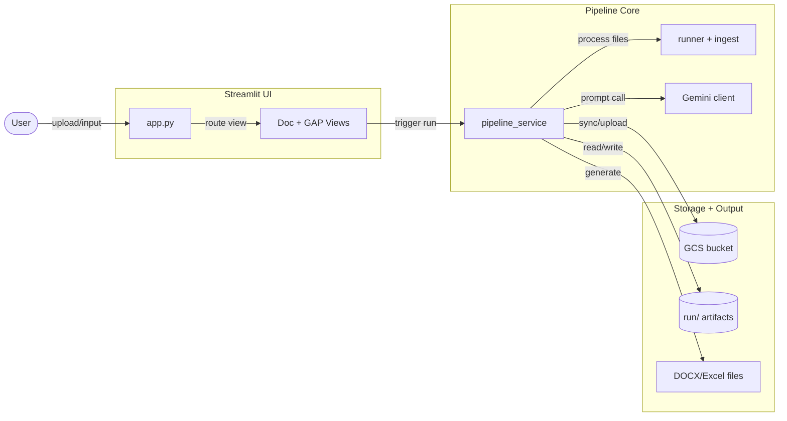
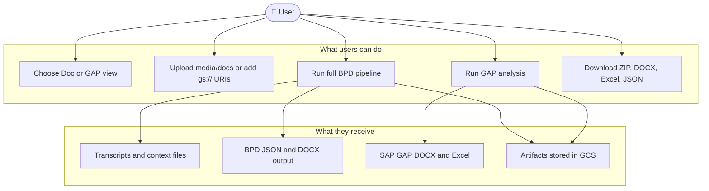
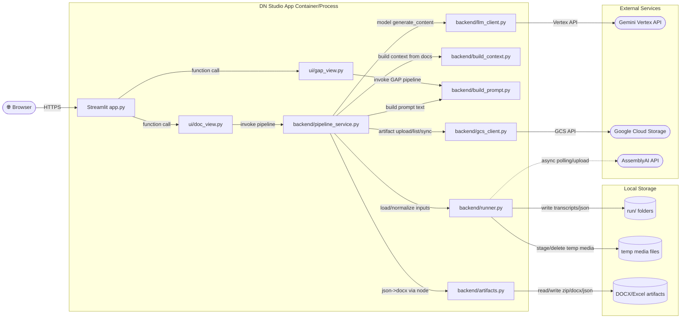
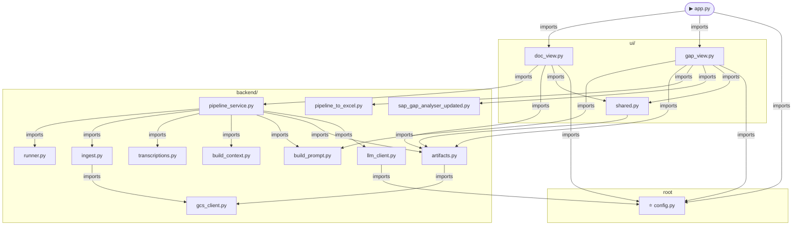

# Architecture - DN Studio

> Auto-generated from repository scan. Last updated: 2026-04-22.
> Re-run after code changes to refresh Mermaid diagrams.

---

## L0 - Slide View

One-glance overview. Designed to fit a 16:9 presentation slide.

---

## L1 - User View

What a person can do with this system.

### Notes
- Doc flow supports local uploads and `gs://` inputs.
- Transcription engine is selectable: local Whisper or AssemblyAI API.
- GAP flow operates on selected run folders and emits DOCX/Excel outputs.

---

## L2 - System View

Services, data stores, and communication paths.

### Notes
- **Deployment**: Docker image runs Streamlit + Python backend + Node (for DOCX template generation).
- **Auth**: Google client libraries use ADC/service-account credentials; AssemblyAI uses `ASSEMBLYAI_API_KEY`.
- **Async**: AssemblyAI path can run parallel workers while preserving ordered persistence.

---

## L3 - Codebase View

Module-level dependency graph for core app flow (dependent -> dependency).

### Notes
- **Entry point**: `app.py`
- **Core dependency**: `config.py` is shared by UI and model client paths.
- **Circular dependencies**: none clearly detected in the scanned core flow.

---

## Open Questions

- [ ] GAP pipeline internals in `backend/sap_gap_analyser_updated.py` are treated as a black box here (single entry function).
- [ ] Frontend `templates/` JS dependency flow is runtime-invoked via subprocess, not represented as imports.
- [ ] Non-core scripts under `gap/` may represent legacy or standalone flows outside the main Streamlit path.
